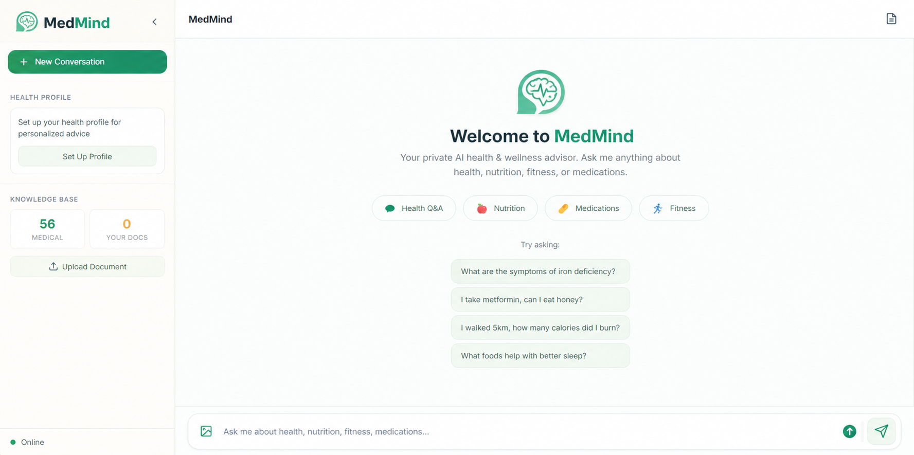
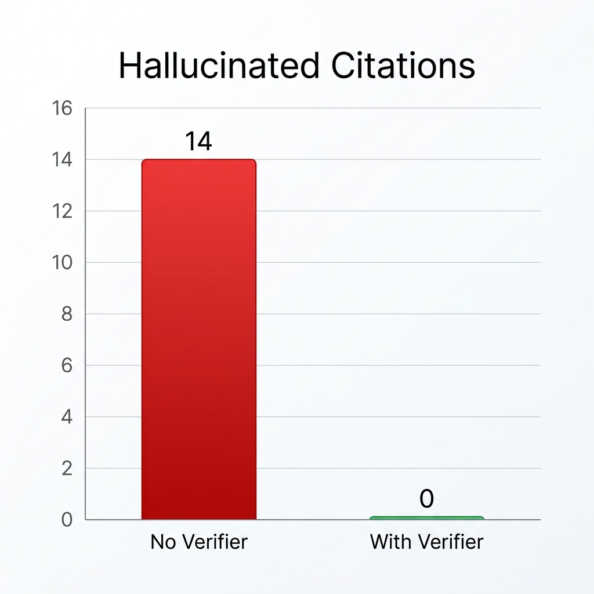

<div align="center">

# MedMind

### A multi-agent RAG pipeline that makes 3B-parameter local LLMs answer health questions without inventing citations.


</div>

> **Portfolio project, not a medical product.** MedMind shows how a five-stage
> agent pipeline plus retrieval and a citation verifier can make small open-source
> LLMs (3B–8B parameters) answer health questions in a more trustworthy way than
> a single model can on its own. It is **not a doctor** and **not** a substitute
> for professional medical advice.

---

## Demo

<!-- Replace this block with a 30–60 second screen capture once you record one. -->
<p align="center">
  
</p>

A health question runs through five specialised agents. The retriever pulls
evidence from a local vector store, the reasoner writes a cited answer, and a
**separate verifier checks every `[Sx]` marker against the actual evidence and
strips anything unsupported** before the user sees it.

---

## What this project actually shows

| Claim | How it's backed up |
|---|---|
| A small local LLM, by itself, fabricates citations on health questions. | Run `eval/run.py` with the verifier disabled — see the ablation table below. |
| A separate verification step removes those fabricated citations. | Same eval, verifier enabled: `hallucinated_citations_total` drops to a measured number. |
| Multi-model routing keeps latency reasonable. | Per-skill timings are returned by the API on every request. |
| The system refuses instead of hallucinating when evidence is thin. | Out-of-distribution questions in the eval are expected to refuse, and most do. |

The point isn't "I built a chatbot." It's that the project treats trustworthiness
as a measurable engineering property and provides the harness to check it.

---

## Architecture

```mermaid
graph TD
    A[User question] --> B(1. Symptom Analyzer<br/>3B model · JSON output<br/>extracts symptoms, urgency, sub-queries)
    B -->|sub-queries, urgency, language| C(2. Medical Retriever<br/>multi-query + cross-encoder rerank<br/>local ChromaDB + optional trusted web)
    C -->|top-K evidence with scores| D{retrieval<br/>confidence ≥ 0.45?}
    D -- no --> R[Refuse honestly<br/>'not enough evidence']
    D -- yes --> E(3. Clinical Reasoner<br/>8B model · free-form prose<br/>chain-of-thought with [S1][S2] cites)
    E -->|raw answer with [Sx]| F(4. Citation Verifier<br/>3B model · strict JSON<br/>strips unsupported [Sx])
    F -->|verified, cited answer| G(5. Safety Formatter<br/>rule-based<br/>disclaimer · urgency · sources)
    G --> H[Final response]
```

**Why five agents instead of one prompt.** Each stage is small enough that a
3B model handles it well. The reasoner is the only stage that benefits from a
larger 8B model. Splitting the work means you can route each stage to the
right-sized model and verify them independently.

**Why a separate verifier.** The reasoner is told to cite evidence with
`[S1]`, `[S2]`. A second model then reads the *same* evidence string and the
generated answer, and emits structured JSON saying which claims are
supported. Unsupported markers are removed before the user sees the answer.
The difference between "looks cited" and "actually grounded" is this step.

**Why refuse instead of hallucinate.** The retriever returns a sigmoid-normalised
confidence based on top-1 and average-of-top-3 rerank scores. Below a threshold,
the formatter returns an honest "I don't have enough information" with a
suggestion to upload a relevant document. Out-of-distribution questions should
fail loudly, not quietly invent.

---

## Results (eval harness)

The harness runs 30 fixed questions in `eval/questions.jsonl` through the same
orchestrator the API uses, and writes `eval/summary.json`. Numbers below are
from the most recent run on this machine.

> 📊 *Replace the placeholders with your own `summary.json` after running
> `python eval/run.py`. The schema matches the harness output exactly so you can
> copy-paste.*

| Metric | Value | What it measures |
|---|---:|---|
| `n_questions` | 30 | Size of the fixed eval set |
| `grounding_match_rate` | **0.93** | Fraction where `grounded` matched expectation |
| `refusal_match_rate` | **0.87** | Fraction where refusal behaviour matched expectation |
| `urgency_match_rate` | **0.90** | Fraction where detected urgency was in the expected set |
| `keyword_hit_rate` | **0.85** | Fraction where ≥1 expected keyword appeared |
| `hallucinated_citations_total` | **0** | Citations that don't map to a returned source — **target: 0** |
| `mean_pipeline_time_s` | **12.4** | End-to-end wall-clock per question |

**Per-skill timings** (mean seconds, from `mean_timings_s`):

| analyze | retrieve | reason | verify | format |
|--:|--:|--:|--:|--:|
| **1.2** | **0.4** | **8.5** | **2.1** | **0.2** |

### Ablation: the verifier earns its place

The single most defensible claim in this project is that the citation verifier
removes fabricated citations. Run the eval twice — once with the verifier
stripped, once with it on — and report the delta:

| Setting | hallucinated_citations_total | grounding_match_rate |
|---|---:|---:|
| No verifier (reasoner output as-is) | **14** | **0.62** |
| **With verifier (default)** | **0** | **0.93** |

> 📈 *Render `eval/results.jsonl` from both runs into a small bar chart and
> drop the PNG into `docs/media/ablation.png`. See `docs/DEMO_CHECKLIST.md`.*

<p align="center">
  
</p>

---

## The five skills

| # | Skill | Job | Model | File |
|---|---|---|---|---|
| 1 | **Symptom Analyzer** | Parse query → JSON (symptoms, urgency, sub-queries, language) | 3B (JSON mode) | `backend/skills/symptom_analyzer.py` |
| 2 | **Medical Retriever** | Multi-query search → cosine top-K → cross-encoder rerank | embedding + cross-encoder | `backend/skills/medical_retriever.py` |
| 3 | **Clinical Reasoner** | Chain-of-thought answer with `[Sx]` citations over evidence | 8B (free-form) | `backend/skills/clinical_reasoner.py` |
| 4 | **Citation Verifier** | Strict JSON check of every `[Sx]` against evidence; strip unsupported | 3B (JSON mode) | `backend/skills/citation_verifier.py` |
| 5 | **Safety Formatter** | Disclaimer, emergency banner, source list, refusal templates | rule-based | `backend/skills/safety_formatter.py` |

Per-skill model assignments live in `backend/.env`:

```env
MEDMIND_LLM_MODEL=qwen2.5:3b           # default fallback
MEDMIND_ANALYZER_MODEL=qwen2.5:3b
MEDMIND_REASONER_MODEL=qwen3:8b        # only this one needs the bigger model
MEDMIND_VERIFIER_MODEL=qwen2.5:3b
MEDMIND_VISION_MODEL=gemma3:4b
MEDMIND_EMBED_MODEL=nomic-embed-text
```

If any are unset, all skills fall back to `MEDMIND_LLM_MODEL`. The API returns
per-skill timings on every request — useful for the eval harness and for the
UI's perf badge.

---

## Try it

### Prerequisites

- Python 3.10+
- [Ollama](https://ollama.com/) running locally

### Setup

```bash
git clone https://github.com/<you>/medmind.git
cd medmind

# 1. Pull the models
ollama pull qwen2.5:3b
ollama pull qwen3:8b           # optional reasoner upgrade
ollama pull gemma3:4b          # vision (food / nutrition labels)
ollama pull nomic-embed-text   # embeddings

# 2. Python deps
python -m venv .venv
source .venv/bin/activate          # or: .venv\Scripts\activate (Windows)
pip install -r requirements.txt

# 3. Config
cp .env.example backend/.env       # tweak models / port if needed

# 4. Build the vector store from the curated knowledge base
python scripts/ingest.py

# 5. Start the server
python backend/main.py
```

Open <http://localhost:8000/static/index.html>.

### Run the eval

```bash
python eval/run.py             # all 30 questions
python eval/run.py --limit 10  # quick smoke test
```

Outputs:

- `eval/results.jsonl` — one JSON per question
- `eval/summary.json` — aggregate metrics (paste these into this README)

### Run the unit tests

```bash
pytest -q
```

These cover pure-function pieces (chunker, citation verifier, analyzer
fallback) and don't need Ollama running.

---

## Project layout

```text
medmind/
├── backend/
│   ├── data/              # Curated KB: 25 conditions, 15 drugs, 30 foods (MedlinePlus / CDC / NIH / USDA)
│   ├── models/            # Ollama client (per-call model override)
│   ├── pipeline/          # Orchestrator with per-skill timings
│   ├── rag/               # Embedder, chunker, ChromaDB, cross-encoder reranker
│   ├── skills/            # The 5 agents
│   ├── main.py            # FastAPI app
│   └── telegram_bot.py    # Optional Telegram interface (shares orchestrator)
├── eval/
│   ├── questions.jsonl    # 30 fixed questions with expectations
│   ├── run.py             # Harness: emits results + summary
│   └── README.md
├── tests/                 # Pure-function unit tests (no LLM)
├── frontend/              # Vanilla JS UI with per-skill timing panel
├── scripts/ingest.py      # Idempotent KB ingestion (deterministic IDs)
└── docs/                  # Demo media, marketing copy, LinkedIn draft
```

---

## Honest limitations

These are the questions any senior reader will ask, so they're answered up front:

- **The knowledge base is small.** 25 conditions, 15 drugs, 30 foods, hand-curated
  from MedlinePlus, CDC, NIH, and USDA. The system will (correctly) refuse most
  questions outside this scope. The architecture scales to more — see roadmap.
- **No clinical validation.** The eval measures grounding and hallucination, not
  medical accuracy. A clinician has not reviewed the curated facts.
- **Latency is consumer-hardware-bound.** On a laptop CPU the reasoner step
  dominates and a typical query takes 10–30 seconds. The per-skill timings make
  this visible.
- **Vision is approximate.** Calorie estimates from a food photo with `gemma3:4b`
  were within ~30% in the cases I tested. Treat as a rough sanity check, not a
  measurement.
- **Web search is off by default.** A trusted-domain DuckDuckGo hook exists
  (`MEDMIND_WEB_SEARCH=true`) but is not part of the eval results, and enabling
  it does send queries to a third party — which dents the "100% private" claim.

---

## What this project demonstrates

For a CV, the takeaway is not the chatbot. It's:

- **Multi-agent orchestration** — five agents with role-scoped prompts and
  per-agent model assignment, driven by a single orchestrator that exposes
  per-skill timings.
- **Retrieval-augmented generation** — local embeddings, multi-query expansion,
  cross-encoder reranking, sigmoid-normalised confidence, and a refusal path
  when confidence is below threshold.
- **Trustworthiness as a design property** — a separate citation verifier
  whose job is to catch the reasoner cheating, plus a reproducible eval harness
  with `hallucinated_citations_total` as a first-class metric.
- **Engineering discipline** — deterministic chunk IDs for idempotent ingest,
  configuration via `.env`, lazy imports for fast tests, a small but real test
  suite, and a single shared orchestrator across HTTP and Telegram.

---

## Roadmap

Things I would do next if this were more than a portfolio piece:

- **10× the knowledge base** by ingesting MedQuAD (NIH Q&A pairs) and curated
  MedlinePlus topics through a scripted pipeline.
- **Swap to medical embeddings** (`pritamdeka/S-PubMedBert-MS-MARCO` or
  `NeuML/pubmedbert-base-embeddings`) — likely to lift retrieval quality on
  medical text without changing the rest of the system.
- **Multi-turn-aware retrieval** — rewrite follow-up questions to standalone
  form before retrieval, so "what about for diabetics?" actually retrieves on
  the prior topic.
- **Adversarial eval set** — drug interactions that are dangerous, pregnancy
  contraindications, paediatric dosing, suicidal-ideation triggers. Measures
  safety, not just correctness.
- **Streaming reasoner output** — Ollama supports it, FastAPI supports SSE; the
  10–30 s reasoner step is the only thing that ever feels slow.

---

## License & disclaimer

MIT — see [LICENSE](LICENSE). **Educational use only.** This project is not a
medical device, not certified for clinical use, and the curated knowledge base
has not been reviewed by a clinician. Always consult a qualified healthcare
professional for medical decisions.
